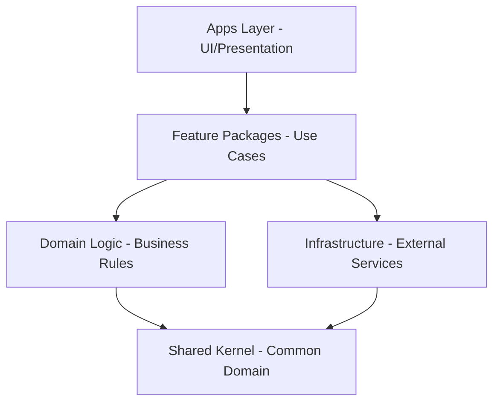

# 🏗️ Enterprise Portal Architecture & Development Standards

> Comprehensive guide for BCBST Portal monorepo architecture, development workflows, and engineering standards.

## 📖 Table of Contents

- [Monorepo Architecture](#monorepo-architecture)
- [Development Setup](#development-setup)
- [Coding Standards](#coding-standards)
- [Monorepo Tooling & Package Management Standards](#monorepo-tooling--package-management-standards)
- [Git Workflow & Conventions](#git-workflow--conventions)
- [Next.js Architecture](#nextjs-architecture)
- [Testing Standards](#testing-standards)
- [Turborepo Commands](#turborepo-commands)
- [Performance & Caching](#performance--caching)
- [Contributing](#contributing)

## 🎯 Monorepo Architecture

### Why Turborepo?

Based on industry research and benchmarks (Vercel, 2025), we chose Turborepo for:

1. **Incremental Builds** - Only rebuild what changed (85% faster builds)
2. **Remote Caching** - Share build artifacts across team (never build twice)
3. **Task Orchestration** - Parallel execution with dependency awareness
4. **Zero Config** - Works with existing package.json scripts

> "Turborepo reduced our CI times from 45 minutes to 8 minutes" - Vercel Case Study

### Project Structure

```
portals-monorepo/
├── apps/                          # Deployable applications
│   ├── member-portal/             # Member-facing portal
│   ├── broker-portal/             # Broker tools portal  
│   ├── employer-portal/           # Employer administration
│   ├── sh-member-portal/          # Simply Healthcare member
│   └── sh-broker-portal/          # Simply Healthcare broker
├── packages/                      # Shared packages
│   ├── ui/                        # Component library (@portals/ui)
│   ├── auth/                      # Authentication logic (@portals/auth)
│   ├── api-client/                # Generated API client (@portals/api-client)
│   ├── shared-types/              # TypeScript types (@portals/shared-types)
│   ├── shared-utils/              # Utility functions (@portals/shared-utils)
│   ├── feature-flags/             # Feature flag system (@portals/feature-flags)
│   ├── analytics/                 # Analytics wrapper (@portals/analytics)
│   ├── config/                    # Shared configs (@portals/config)
│   ├── eslint-config/             # ESLint presets (@portals/eslint-config)
│   └── typescript-config/         # TypeScript configs (@portals/typescript-config)
├── tooling/                       # Build and dev tools
│   ├── generators/                # Code generators
│   ├── scripts/                   # Automation scripts
│   └── docker/                    # Docker configurations
├── docs/                          # Documentation
├── .github/                       # GitHub Actions
├── turbo.json                     # Turborepo config
├── package.json                   # Root package.json
├── pnpm-workspace.yaml           # pnpm workspace config
└── README.md                      # This file
```

### Package Architecture Principles

Based on Domain-Driven Design and Clean Architecture:



**Layer Definitions:**
- **Apps Layer**: Next.js applications, UI components, user-facing code
- **Feature Packages**: Application services, use cases, orchestration logic
- **Domain Logic**: Pure business rules, entities, value objects, domain services - no framework dependencies
- **Infrastructure**: Database access, API clients, third-party integrations
- **Shared Kernel**: Common domain concepts, types, and utilities shared across bounded contexts

**DDD Implementation:**
- Feature packages align with Bounded Contexts
- Domain entities use value objects for type safety
- Repositories defined as interfaces in Domain, implemented in Infrastructure
- No framework-specific imports in Domain layer

**Dependency Rules:**
1. Dependencies only flow downward
2. Circular dependencies are forbidden
3. Apps can depend on any package
4. Packages cannot depend on apps

## 🚀 Development Setup

### Prerequisites

- Node.js 20.x (use `nvm` for version management)
- Git 2.x
- Docker Desktop (for local services)

> **Note on pnpm**: The project uses `pnpm` for package management. If you don't have `pnpm` installed globally, the `npm start` command will attempt to install it locally for the project.

### Initial Setup & Starting the Project

1.  **Clone the repository:**
    ```bash
    git clone git@github.com:bcbst/portals-monorepo.git
    # or your repository URL
    ```

2.  **Navigate into the project directory:**
    ```bash
    cd portals-monorepo
    ```

3.  **Start the project:**
    ```bash
    npm start
    ```
    This command will:
    *   Check for `pnpm` and install it locally if not found.
    *   Install all workspace dependencies using `pnpm install`.
    *   Build all packages and applications using `pnpm turbo run build`.
    *   Start the `broker-portal` (by default) in development mode.

    You can then access the `broker-portal` at `http://localhost:3000` (or the port indicated in the console output).

### IDE Configuration

#### VS Code (Recommended)

Install required extensions:
```json
{
  "recommendations": [
    "dbaeumer.vscode-eslint",
    "esbenp.prettier-vscode",
    "bradlc.vscode-tailwindcss",
    "ms-vscode.vscode-typescript-next",
    "christian-kohler.path-intellisense",
    "formulahendry.auto-rename-tag",
    "steoates.autoimport",
    "yoavbls.pretty-ts-errors"
  ]
}
```

Settings (.vscode/settings.json):
```json
{
  "editor.formatOnSave": true,
  "editor.defaultFormatter": "esbenp.prettier-vscode",
  "editor.codeActionsOnSave": {
    "source.fixAll.eslint": true,
    "source.organizeImports": true
  },
  "typescript.tsdk": "node_modules/typescript/lib",
  "typescript.enablePromptUseWorkspaceTsdk": true,
  "tailwindCSS.experimental.classRegex": [
    ["cva\\(([^)]*)\\)", "[\"'`]([^\"'`]*).*?[\"'`]"],
    ["cx\\(([^)]*)\\)", "(?:'|\"|`)([^']*)(?:'|\"|`)"]
  ]
}
```

## 📝 Coding Standards

### TypeScript Guidelines

Based on Google TypeScript Style Guide and Airbnb standards:

#### 1. **Type Safety First**

```typescript
// ✅ CORRECT: Explicit types, no any
interface UserProfile {
  id: string
  email: string
  role: UserRole
  preferences: UserPreferences
}

function processUser(user: UserProfile): Result<ProcessedUser, ProcessError> {
  // Implementation
}

// ❌ WRONG: Implicit any, loose typing
function processUser(user: any) {
  return user.process() // What is user? What does it return?
}
```

#### 2. **Branded Types for Domain Modeling**

Reference: "Domain Modeling Made Functional" - Scott Wlaschin

```typescript
// ✅ CORRECT: Type-safe IDs prevent mixing
type UserId = Brand<string, 'UserId'>
type OrderId = Brand<string, 'OrderId'>

function getOrdersForUser(userId: UserId): Promise<Order[]> {
  // Implementation
}

// This won't compile - type safety!
const orderId: OrderId = 'ord_123' as OrderId
getOrdersForUser(orderId) // ❌ Type error

// ❌ WRONG: String IDs can be mixed up
function getOrdersForUser(userId: string): Promise<Order[]> {
  // What if someone passes an orderId?
}
```

#### 3. **Functional Error Handling**

Based on Railway Oriented Programming:

```typescript
// ✅ CORRECT: Explicit error handling
type Result<T, E> = Success<T> | Failure<E>

async function fetchUserProfile(id: UserId): Promise<Result<UserProfile, ApiError>> {
  try {
    const data = await api.get(`/users/${id}`)
    return Result.success(data)
  } catch (error) {
    return Result.failure(new ApiError('Failed to fetch user', error))
  }
}

// Usage forces error handling
const result = await fetchUserProfile(userId)
if (result.isSuccess) {
  // TypeScript knows result.value is UserProfile
  console.log(result.value.email)
} else {
  // TypeScript knows result.error is ApiError
  logger.error(result.error)
}

// ❌ WRONG: Throwing errors loses type safety
async function fetchUserProfile(id: string): Promise<UserProfile> {
  const data = await api.get(`/users/${id}`) // Might throw
  return data // What if data is null?
}
```

### Configuration Management

**ESLint/Prettier Setup:**

Base configs in packages:
```javascript
// packages/eslint-config/index.js
module.exports = {
  extends: ['next', 'prettier'],
  rules: { /* base rules */ }
}

// App usage: apps/member-portal/.eslintrc.js
module.exports = {
  extends: ['@portals/eslint-config/next'],
  rules: { /* app-specific overrides */ }
}
```

**TypeScript Config:**
```json
// packages/typescript-config/nextjs.json
{
  "extends": "./base.json",
  "compilerOptions": { /* Next.js specific */ }
}
```

### React/Next.js Standards

Based on React Core Team recommendations and Next.js best practices:

#### 1. **Component Structure**

```typescript
// ✅ CORRECT: Clear separation of concerns
// components/member-dashboard/member-dashboard.tsx
import { memo } from 'react'
import { useMemberData } from './hooks/use-member-data'
import { MemberDashboardProps } from './member-dashboard.types'
import { DashboardLayout } from './components/dashboard-layout'

export const MemberDashboard = memo<MemberDashboardProps>(({ memberId }) => {
  const { data, loading, error } = useMemberData(memberId)
  
  if (loading) return <DashboardSkeleton />
  if (error) return <DashboardError error={error} />
  
  return (
    <DashboardLayout>
      <DashboardHeader member={data} />
      <DashboardContent member={data} />
    </DashboardLayout>
  )
})

MemberDashboard.displayName = 'MemberDashboard'
```

#### 2. **Custom Hooks Pattern**

```typescript
// ✅ CORRECT: Encapsulated logic with clear return types
function useMemberData(memberId: UserId) {
  const [state, setState] = useState<AsyncState<MemberData>>({ 
    status: 'idle' 
  })
  
  useEffect(() => {
    let cancelled = false
    
    async function fetchData() {
      setState({ status: 'loading' })
      
      const result = await memberService.getMemberData(memberId)
      
      if (!cancelled) {
        if (result.isSuccess) {
          setState({ status: 'success', data: result.value })
        } else {
          setState({ status: 'error', error: result.error })
        }
      }
    }
    
    fetchData()
    
    return () => { cancelled = true }
  }, [memberId])
  
  return state
}
```

### File Naming Conventions

Based on community standards (Airbnb, Google):

```
✅ CORRECT:
components/
├── member-card/                 # kebab-case folders
│   ├── member-card.tsx         # kebab-case files
│   ├── member-card.test.tsx    # test suffix
│   ├── member-card.stories.tsx # stories suffix
│   └── index.ts                # barrel export

hooks/
├── use-member-data.ts          # use- prefix for hooks
└── use-auth.ts

utils/
├── format-currency.ts          # verb-noun pattern
└── validate-email.ts

types/
├── member.types.ts             # .types suffix
└── api.types.ts

❌ WRONG:
memberCard.tsx                  # camelCase files
MemberCard.tsx                  # PascalCase files
member_card.tsx                 # snake_case
usememberdata.ts               # no separation
```

## 🔧 Monorepo Tooling & Package Management Standards

This section outlines the best practices adopted for managing our monorepo with Turborepo, pnpm, and TypeScript, ensuring a scalable, maintainable, and efficient development environment.

### Turborepo Best Practices

Our use of Turborepo is guided by its core principles to maximize build performance and developer experience:

1.  **Workspace Structure (`apps/` & `packages/`):**
    *   **Rationale:** This is a foundational Turborepo convention. `apps/` contains deployable applications (e.g., Next.js sites), while `packages/` holds shared code (UI components, utilities, configs). This separation clarifies intent and aids Turborepo's dependency analysis.
    *   **Implementation:** Each application or shared library within these directories is its own package with a `package.json`.

2.  **Dependency Management:**
    *   **Install Where Used:** Dependencies are declared in the `package.json` of the specific package that directly imports them. Avoid hoisting all dependencies to the root.
    *   **Rationale:** Enhances clarity of package-specific needs, allows for flexible versioning across packages if necessary, and optimizes Turborepo's caching and pruning (e.g., for lighter Docker images).
    *   **Root Dependencies:** The root `package.json` should only contain devDependencies for managing the repository itself (e.g., `turbo`, `prettier`, `husky`).

3.  **Package Granularity & Purpose:**
    *   **Single Purpose per Package:** Shared packages in `packages/` should have a clearly defined, single responsibility (e.g., `@portals/ui`, `@portals/auth`, `@portals/logger`).
    *   **Rationale:** Simplifies understanding the monorepo's architecture as it scales and allows Turborepo to more effectively manage the dependency graph.
    *   **Application Packages as Endpoints:** Applications in `apps/` are the consumers of shared packages and represent the final deployable units. They generally should not be imported by other packages.

4.  **Configuration & Caching:**
    *   **Root `turbo.json`:** Defines the task pipeline, dependencies between tasks (e.g., `build` depends on `^build`), and caching strategies (inputs/outputs).
    *   **Rationale:** Centralizes build orchestration and enables Turborepo's powerful caching mechanisms.
    *   **Lockfiles (`pnpm-lock.yaml`):** Always committed to ensure reproducible builds and to help Turborepo understand the internal dependency graph.

5.  **Cross-Package Access:**
    *   **No Direct File Path Imports:** Avoid `../../packages/some-package` imports. Instead, if `app-a` needs code from `package-b`, `package-b` should export its functionality, and `app-a` should list `package-b` as a dependency (using workspace protocol, e.g., `"@portals/common-utils": "workspace:*"`).
    *   **Rationale:** Enforces clear package boundaries and allows package managers and Turborepo to manage dependencies correctly.

### pnpm & TypeScript Package Organization

We leverage pnpm's efficiency and TypeScript's type safety with the following conventions:

1.  **`pnpm-workspace.yaml`:**
    *   Defines the locations of our packages (typically `apps/*` and `packages/*`), enabling pnpm's workspace features.
    *   **Rationale:** Essential for pnpm to discover and manage individual packages within the monorepo.

2.  **`package.json` in Each Package:**
    *   **Contents:** Must include a unique `name` (scoped with `@portals/`), relevant `scripts`, its own `dependencies`/`devDependencies`, and an `exports` field.
    *   **`exports` Field:** Clearly defines the package's public API and entry points for different module systems (ESM, CJS) and type definitions.
    *   **Rationale:** The `exports` field offers more control and explicitness over package entry points than older fields like `main`, improving tree-shaking and module resolution.

3.  **TypeScript Configuration (`tsconfig.json`):**
    *   **Package-Specific `tsconfig.json`:** Each app and package has its own `tsconfig.json`.
    *   **Shared Base Configs (`packages/typescript-config`):** A dedicated `typescript-config` package (as documented in Project Structure) provides base TypeScript configurations (e.g., `base.json`, `nextjs.json`, `library.json`). Individual packages `extend` these.
    *   **Rationale:** Promotes consistency while allowing package-specific overrides. Avoids a single root `tsconfig.json` for better caching and modularity, as recommended by Turborepo.
    *   **No TypeScript Project References:** We rely on Turborepo for build orchestration rather than TypeScript's built-in project references, which can add complexity.

4.  **Compiling & Exporting Libraries:**
    *   **`tsc` for Libraries:** Shared library packages in `packages/` are typically compiled using `tsc` directly.
    *   **Rationale:** Avoids unnecessary bundling complexities for libraries, ensuring they are consumed cleanly by application bundlers.

### Specialized Packages: `@portals/logger` and `@portals/testing`

Two key shared packages, `@portals/logger` and `@portals/testing`, are included in our `packages/` directory to centralize common concerns:

*   **`@portals/logger`:**
    *   **Purpose:** Provides a standardized, pre-configured logging solution (e.g., using Pino for structured JSON logging) for all applications and packages.
    *   **Rationale:**
        *   **Consistency:** Ensures uniform log formats, levels, and destinations across the monorepo, simplifying log aggregation and analysis (e.g., with Splunk).
        *   **Centralized Control:** Allows global updates to logging behavior (e.g., changing libraries, redaction rules) from a single place.
        *   **DRY:** Avoids repetitive logger setup in each consuming package.
    *   **Usage:** Apps and packages will import and use the configured logger instance or factory from `@portals/logger`.

*   **`@portals/testing`:**
    *   **Purpose:** Houses shared testing configurations, utilities, global mocks (e.g., for MSW), and base setups (e.g., Jest presets, Cypress support files).
    *   **Rationale:**
        *   **DRY Configurations:** Centralizes common testing boilerplate, reducing duplication in each package's test setup.
        *   **Shared Utilities:** Provides reusable test helpers, custom matchers, and data factories, promoting consistency in testing practices.
        *   **Standardized Mocks:** Ensures global objects or common external services are mocked uniformly.
    *   **Scope:** While this package provides shared *infrastructure*, individual test spec files (`*.test.tsx`, `*.spec.ts`) should be co-located with the source code they are testing within each respective app or package, as per our "Test File Organization" standard.

By adhering to these monorepo tooling and package management standards, we aim to create a robust, scalable, and developer-friendly environment that leverages the full potential of Turborepo, pnpm, and TypeScript.

## 🌿 Git Workflow & Conventions

### Branch Naming Convention

Based on git-flow and GitHub flow best practices:

#### Format: `<type>/<ticket>-<description>`

| Type | Purpose | Example |
|------|---------|---------|
| `feature/` | New functionality | `feature/PRT-123-add-member-search` |
| `fix/` | Bug fixes | `fix/PRT-456-resolve-login-error` |
| `hotfix/` | Urgent production fixes | `hotfix/PRT-789-critical-auth-bypass` |
| `chore/` | Maintenance tasks | `chore/PRT-321-update-dependencies` |
| `docs/` | Documentation only | `docs/PRT-654-api-documentation` |
| `test/` | Test additions/fixes | `test/PRT-987-add-e2e-coverage` |
| `refactor/` | Code refactoring | `refactor/PRT-246-optimize-queries` |
| `perf/` | Performance improvements | `perf/PRT-135-reduce-bundle-size` |

**Rules:**
1. Always include ticket number
2. Use kebab-case for descriptions
3. Keep under 50 characters
4. Be specific but concise

### Commit Message Convention

Following Conventional Commits 1.0.0:

#### Format: `<type>(<scope>): <subject>`

```bash
# ✅ CORRECT Examples:
feat(auth): implement SSO login with Okta
fix(member-portal): resolve date picker timezone issue  
docs(api): add OpenAPI documentation for v2 endpoints
perf(ui): lazy load heavy chart components
test(claims): add integration tests for claim submission
chore(deps): upgrade to Next.js 14.1

# With breaking changes:
feat(api)!: change response format for /members endpoint

BREAKING CHANGE: Response now returns data in `items` array instead of root array

# ❌ WRONG:
Updated stuff              # No type or scope
fix: fixed the thing      # Too vague
FEAT(Auth): Add SSO       # Wrong case
feat(all): various fixes  # Too broad
```

**Types:**
- `feat`: New feature
- `fix`: Bug fix
- `docs`: Documentation only
- `style`: Code style (formatting, semicolons)
- `refactor`: Code change without fixing bug or adding feature
- `perf`: Performance improvement
- `test`: Adding/updating tests
- `chore`: Maintenance tasks
- `ci`: CI/CD changes
- `build`: Build system changes

### Pull Request Standards

#### PR Title Format
`[<ticket>] <type>: <description>`

Example: `[PRT-123] feat: Add member search functionality`

#### PR Template (.github/pull_request_template.md)
```markdown
## Description
Brief description of changes

## Type of Change
- [ ] Bug fix (non-breaking change)
- [ ] New feature (non-breaking change)
- [ ] Breaking change
- [ ] Documentation update

## Testing
- [ ] Unit tests pass
- [ ] Integration tests pass
- [ ] Manual testing completed
- [ ] Accessibility tested

## Checklist
- [ ] Code follows style guidelines
- [ ] Self-review completed
- [ ] Comments added for complex code
- [ ] Documentation updated
- [ ] No new warnings
- [ ] Changes are backwards compatible

## Screenshots (if applicable)
Before | After
--- | ---
[image] | [image]

## Related Issues
Closes #123
```

### Code Review Process

Based on Google's Code Review Guidelines:

1. **Automated Checks** (must pass)
   - ESLint/Prettier
   - TypeScript compilation
   - Unit tests
   - Build verification

2. **Human Review Focus**
   - Business logic correctness
   - Security implications
   - Performance impact
   - Code clarity
   - Test coverage

3. **Review Etiquette**
   - Respond within 24 hours
   - Be constructive, not critical
   - Suggest improvements, don't demand
   - Approve if "good enough" (perfect is the enemy of good)

## 🚀 Next.js Architecture

### Data Fetching Patterns

**Server Components (Default)**
```typescript
// Fetch data on server, no client bundle impact
async function MemberList() {
  const members = await db.member.findMany() // Runs on server
  return <MemberTable members={members} />
}
```

**Client Components**
```typescript
'use client'
// For interactivity, hooks, browser APIs
function InteractiveChart({ data }) {
  const [filter, setFilter] = useState('all')
  // Client-side logic
}
```

**Server Actions**
```typescript
// app/actions.ts
'use server'
export async function updateProfile(formData: FormData) {
  const validated = profileSchema.parse(formData)
  await db.member.update(validated)
  revalidatePath('/profile')
}
```

**Route Handlers**
```typescript
// app/api/webhook/route.ts
export async function POST(request: Request) {
  // For webhooks, external API integrations
}
```

### Route Groups Pattern

Based on Next.js 14 App Router best practices:

```
app/
├── (auth)/                      # Route group - no URL impact
│   ├── login/
│   ├── register/
│   └── layout.tsx              # Shared auth layout
├── (dashboard)/                 # Main app group
│   ├── layout.tsx              # Dashboard layout
│   ├── page.tsx                # /
│   ├── benefits/               # /benefits
│   ├── claims/                 # /claims
│   └── profile/                # /profile
└── (public)/                    # Public pages group
    ├── layout.tsx              # Public layout
    ├── about/                  # /about
    └── contact/                # /contact
```

**Benefits:**
1. Organize without affecting URLs
2. Multiple root layouts
3. Clear separation of concerns
4. Easy to apply group-specific middleware

### Parallel Routes Pattern

For complex UIs with independent sections:

```typescript
// app/(dashboard)/layout.tsx
export default function DashboardLayout({
  children,
  notifications,  // @notifications slot
  analytics,      // @analytics slot
  activity,       // @activity slot
}: {
  children: React.ReactNode
  notifications: React.ReactNode
  analytics: React.ReactNode
  activity: React.ReactNode
}) {
  return (
    <div className="dashboard-grid">
      <aside className="sidebar">
        {notifications}
      </aside>
      <main className="main-content">
        {children}
      </main>
      <section className="analytics">
        {analytics}
      </section>
      <section className="activity-feed">
        {activity}
      </section>
    </div>
  )
}

// app/(dashboard)/@notifications/page.tsx
export default async function Notifications() {
  const data = await getNotifications()
  return <NotificationsList data={data} />
}

// Each slot can have its own loading/error states
// app/(dashboard)/@analytics/loading.tsx
export default function AnalyticsLoading() {
  return <AnalyticsSkeleton />
}
```

### Intercepting Routes Pattern

For modals and overlays:

```
app/
├── photos/
│   ├── [id]/
│   │   └── page.tsx            # Full page view
│   └── page.tsx                # Gallery
└── @modal/
    └── (.)photos/
        └── [id]/
            └── page.tsx        # Modal view
```

### Caching Strategy

Based on Next.js caching best practices and performance research:

#### 1. **Static Generation (Default)**
```typescript
// ✅ Cached at build time
export default async function Page() {
  const data = await fetch('https://api.example.com/data')
  return <Component data={data} />
}
```

#### 2. **Dynamic Rendering**
```typescript
// Force dynamic rendering when needed
export const dynamic = 'force-dynamic'
// or
export const revalidate = 0
```

#### 3. **Incremental Static Regeneration**
```typescript
// Revalidate every 60 seconds
export const revalidate = 60

// Or on-demand
import { revalidatePath, revalidateTag } from 'next/cache'

// In a Server Action
async function updateData() {
  // Update data
  revalidatePath('/dashboard')
  // or
  revalidateTag('member-data')
}
```

#### 4. **Data Cache Control**
```typescript
// Cache with tags for granular invalidation
const data = await fetch('https://api.example.com/members', {
  next: { 
    revalidate: 3600, // 1 hour
    tags: ['members'] 
  }
})

// Cache indefinitely until invalidated
const staticData = await fetch('https://api.example.com/config', {
  cache: 'force-cache'
})

// Never cache
const realtimeData = await fetch('https://api.example.com/live', {
  cache: 'no-store'
})
```

## 🧪 Testing Standards

### Testing Philosophy

Based on Kent C. Dodds' Testing Trophy and React Testing Library principles:

```
         🏆 E2E Tests (5%)
        /  \  Critical user journeys
       /    \
      /  UI  \  Integration Tests (25%)
     / Tests  \ Component interactions
    /          \
   /   Unit     \ Unit Tests (70%)
  /    Tests     \ Business logic, utilities
 /________________\
```

### Test File Organization

```
src/
├── components/
│   └── member-card/
│       ├── member-card.tsx
│       ├── member-card.test.tsx      # Unit/integration tests
│       └── member-card.e2e.ts        # E2E tests
├── utils/
│   ├── format-currency.ts
│   └── format-currency.test.ts       # Unit tests
└── __tests__/
    ├── integration/                  # Cross-component tests
    └── e2e/                         # End-to-end scenarios
```

### Unit Testing Standards

#### 1. **Test Structure (AAA Pattern)**
```typescript
describe('formatCurrency', () => {
  it('should format USD currency with 2 decimal places', () => {
    // Arrange
    const amount = 1234.56
    const currency = 'USD'
    
    // Act
    const result = formatCurrency(amount, currency)
    
    // Assert
    expect(result).toBe('$1,234.56')
  })
  
  it('should handle negative amounts', () => {
    // Arrange
    const amount = -500
    
    // Act
    const result = formatCurrency(amount)
    
    // Assert
    expect(result).toBe('-$500.00')
  })
})
```

#### 2. **Component Testing**
```typescript
import { render, screen } from '@testing-library/react'
import userEvent from '@testing-library/user-event'
import { MemberCard } from './member-card'

describe('MemberCard', () => {
  const mockMember = {
    id: '123',
    name: 'John Doe',
    email: 'john@example.com',
    status: 'active' as const
  }
  
  it('renders member information', () => {
    render(<MemberCard member={mockMember} />)
    
    expect(screen.getByText('John Doe')).toBeInTheDocument()
    expect(screen.getByText('john@example.com')).toBeInTheDocument()
    expect(screen.getByText('active')).toBeInTheDocument()
  })
  
  it('calls onEdit when edit button clicked', async () => {
    const user = userEvent.setup()
    const handleEdit = jest.fn()
    
    render(<MemberCard member={mockMember} onEdit={handleEdit} />)
    
    await user.click(screen.getByRole('button', { name: /edit/i }))
    
    expect(handleEdit).toHaveBeenCalledWith(mockMember.id)
    expect(handleEdit).toHaveBeenCalledTimes(1)
  })
  
  it('is keyboard accessible', async () => {
    const user = userEvent.setup()
    const handleEdit = jest.fn()
    
    render(<MemberCard member={mockMember} onEdit={handleEdit} />)
    
    // Tab to button
    await user.tab()
    expect(screen.getByRole('button', { name: /edit/i })).toHaveFocus()
    
    // Activate with Enter
    await user.keyboard('{Enter}')
    expect(handleEdit).toHaveBeenCalled()
  })
})
```

### Integration Testing with Storybook

```typescript
// member-card.stories.tsx
import type { Meta, StoryObj } from '@storybook/react'
import { within, userEvent, expect } from '@storybook/test'
import { MemberCard } from './member-card'

const meta: Meta<typeof MemberCard> = {
  component: MemberCard,
  title: 'Domain/MemberCard',
}

export default meta

export const Interactive: StoryObj = {
  args: {
    member: {
      id: '123',
      name: 'Jane Smith',
      email: 'jane@example.com',
      status: 'active'
    }
  },
  play: async ({ canvasElement }) => {
    const canvas = within(canvasElement)
    
    // Verify initial render
    await expect(canvas.getByText('Jane Smith')).toBeInTheDocument()
    
    // Test interaction
    const editButton = canvas.getByRole('button', { name: /edit/i })
    await userEvent.click(editButton)
    
    // Verify state change
    await expect(canvas.getByText('Editing...')).toBeInTheDocument()
  }
}
```

### E2E Testing Standards

Using Playwright for E2E tests:

```typescript
// e2e/member-flow.spec.ts
import { test, expect } from '@playwright/test'

test.describe('Member Portal Flow', () => {
  test.beforeEach(async ({ page }) => {
    // Login before each test
    await page.goto('/login')
    await page.fill('[name="email"]', 'test@example.com')
    await page.fill('[name="password"]', 'password123')
    await page.click('button[type="submit"]')
    await page.waitForURL('/dashboard')
  })
  
  test('should view and update profile', async ({ page }) => {
    // Navigate to profile
    await page.click('text=Profile')
    await expect(page).toHaveURL('/profile')
    
    // Update phone number
    const phoneInput = page.locator('[name="phone"]')
    await phoneInput.clear()
    await phoneInput.fill('555-0123')
    
    // Save changes
    await page.click('text=Save Changes')
    
    // Verify success
    await expect(page.locator('.toast')).toContainText('Profile updated')
  })
  
  test('should handle errors gracefully', async ({ page }) => {
    // Force an error
    await page.route('**/api/profile', route => 
      route.fulfill({ status: 500 })
    )
    
    await page.goto('/profile')
    
    // Verify error handling
    await expect(page.locator('.error-message')).toContainText(
      'Unable to load profile'
    )
  })
})
```

### Test Configuration

#### Jest Configuration (jest.config.js)
```javascript
module.exports = {
  preset: 'ts-jest',
  testEnvironment: 'jsdom',
  setupFilesAfterEnv: ['<rootDir>/test/setup.ts'],
  moduleNameMapper: {
    '^@/(.*)$': '<rootDir>/src/$1',
    '^@portals/(.*)$': '<rootDir>/packages/$1/src',
    '\\.(css|less|scss|sass)$': 'identity-obj-proxy',
  },
  collectCoverageFrom: [
    'src/**/*.{ts,tsx}',
    '!src/**/*.d.ts',
    '!src/**/*.stories.tsx',
    '!src/**/*.test.{ts,tsx}',
  ],
  coverageThreshold: {
    global: {
      branches: 80,
      functions: 80,
      lines: 80,
      statements: 80,
    },
  },
}
```

#### Test Setup (test/setup.ts)
```typescript
import '@testing-library/jest-dom'
import { cleanup } from '@testing-library/react'
import { afterEach } from 'vitest'

// Cleanup after each test
afterEach(() => {
  cleanup()
})

// Mock Next.js router
jest.mock('next/navigation', () => ({
  useRouter() {
    return {
      push: jest.fn(),
      replace: jest.fn(),
      prefetch: jest.fn(),
    }
  },
  useSearchParams() {
    return new URLSearchParams()
  },
}))

// Mock IntersectionObserver
global.IntersectionObserver = jest.fn().mockImplementation(() => ({
  observe: () => null,
  unobserve: () => null,
  disconnect: () => null,
}))
```

## 🚀 Turborepo Commands

### Essential Commands

```bash
# Development
pnpm dev              # Start all apps in dev mode
pnpm dev:member       # Start only member portal
pnpm dev --filter=@portals/ui    # Dev specific package

# Building
pnpm build            # Build all apps and packages
pnpm build:apps       # Build only apps
pnpm build:packages   # Build only packages

# Testing
pnpm test             # Run all tests
pnpm test:unit        # Unit tests only
pnpm test:e2e         # E2E tests only
pnpm test:watch       # Watch mode

# Linting & Formatting
pnpm lint             # Lint all code
pnpm lint:fix         # Fix lint issues
pnpm format           # Format with Prettier
pnpm typecheck        # TypeScript check

# Package Management
pnpm add lodash --filter=member-portal    # Add to specific app
pnpm add -D jest --filter=@portals/ui     # Add dev dep to package
pnpm update --latest --recursive           # Update all dependencies

# Turborepo Specific
pnpm turbo run build --dry-run           # See what would run
pnpm turbo run build --graph             # Visualize task graph
pnpm turbo run build --force             # Ignore cache
pnpm turbo run build --continue          # Continue on error
pnpm turbo daemon status                 # Check daemon status
pnpm turbo daemon restart                # Restart daemon
```

### Custom Scripts

```json
// package.json
{
  "scripts": {
    "dev": "turbo run dev",
    "dev:member": "turbo run dev --filter=member-portal",
    "build": "turbo run build",
    "build:analyze": "ANALYZE=true turbo run build",
    "test": "turbo run test",
    "test:coverage": "turbo run test:coverage",
    "lint": "turbo run lint",
    "clean": "turbo run clean && rm -rf node_modules",
    "changeset": "changeset",
    "version": "changeset version",
    "release": "turbo run build && changeset publish",
    "doctor": "pnpm dlx @turbo/doctor",
    "graph": "turbo run build --graph"
  }
}
```

### Turbo Configuration (turbo.json)

```json
{
  "$schema": "https://turbo.build/schema.json",
  "globalDependencies": ["**/.env.*local"],
  "pipeline": {
    "build": {
      "dependsOn": ["^build"],
      "outputs": ["dist/**", ".next/**", "!.next/cache/**"],
      "env": ["NODE_ENV", "NEXT_PUBLIC_*"]
    },
    "dev": {
      "cache": false,
      "persistent": true
    },
    "test": {
      "dependsOn": ["build"],
      "outputs": ["coverage/**"],
      "cache": false
    },
    "lint": {
      "outputs": []
    },
    "clean": {
      "cache": false
    }
  },
  "globalEnv": [
    "CI",
    "NODE_ENV",
    "VERCEL_URL"
  ]
}
```

### Workspace Commands

```bash
# Run command in all workspaces
pnpm -r exec -- rm -rf node_modules

# Run in specific workspace
pnpm --filter member-portal exec -- npm run custom-script

# List all workspaces
pnpm ls -r --depth -1

# Check for outdated packages
pnpm outdated -r

# Update dependencies interactively
pnpm up -i -r --latest
```

## ⚡ Performance & Caching

### Monitoring Tools

- **APM**: Datadog for application performance monitoring
- **Analytics**: Google Analytics 4 + Amplitude for user behavior
- **Synthetic**: Lighthouse CI runs on every PR
- **Real User Monitoring**: Core Web Vitals via Datadog RUM

### Alerting

Based on Performance Targets table:
- PagerDuty alerts for critical thresholds
- Slack notifications for warnings
- Weekly performance reports to #portal-performance

### Debugging Performance

1. **Next.js Profiler**: Built-in React DevTools Profiler
2. **Bundle Analysis**: `ANALYZE=true pnpm build`
3. **APM Traces**: Datadog distributed tracing
4. **Database**: Prisma query insights

### Server-side Caching

- **Redis**: Session storage and API response caching
- **CDN**: Cloudflare for static assets
- **Database**: Query result caching with Redis

## 🔒 Security Standards

### Common Vulnerabilities & Mitigations

1. **Input Validation**
   - Validate all inputs using Zod schemas
   - Sanitize user content with DOMPurify
   - Use parameterized queries (Prisma/TypeORM)

2. **Authentication & Authorization**
   - JWT validation via `@portals/auth` package
   - Role-based access control (RBAC)
   - Session management with secure cookies

3. **Secret Management**
   - Environment variables for configuration
   - Never commit secrets to repository
   - Use Azure Key Vault for production secrets
   - Rotate credentials quarterly

4. **Dependency Security**
   ```bash
   # Run weekly
   pnpm audit
   pnpm update --latest --interactive
   
   # GitHub Dependabot enabled for automated PRs
   ```

5. **Security Headers**
   ```typescript
   // next.config.js
   const securityHeaders = [
     { key: 'X-Frame-Options', value: 'DENY' },
     { key: 'X-Content-Type-Options', value: 'nosniff' },
     { key: 'Referrer-Policy', value: 'strict-origin-when-cross-origin' }
   ]
   ```

## 🚢 Deployment & Environments

### Environment Strategy

| Environment | Purpose | URL | Branch |
|------------|---------|-----|--------|
| Development | Local development | localhost:3000 | feature/* |
| QA | Integration testing | qa.portals.bcbst.com | develop |
| Staging | UAT & final testing | staging.portals.bcbst.com | release/* |
| Production | Live environment | portals.bcbst.com | main |

### CI/CD Pipeline

```yaml
# Simplified GitHub Actions flow
on:
  push:
    branches: [main, develop, release/*]
  pull_request:

jobs:
  test:
    - pnpm install
    - pnpm lint
    - pnpm test
    - pnpm build
  
  deploy:
    - Deploy to Vercel (preview for PRs)
    - Deploy to Azure (for main branches)
```

### Environment Variables

```bash
# .env.local (development)
# .env.qa, .env.staging, .env.production (CI/CD managed)

NEXT_PUBLIC_API_URL=
DATABASE_URL=
AUTH_SECRET=
AZURE_STORAGE_CONNECTION=
```

### Rollback Strategy

1. **Vercel**: Use instant rollback to previous deployment
2. **Database**: Migrations are forward-only with compensating migrations
3. **Feature Flags**: Disable features without deployment

## 📝 Contributing

### Documentation Updates

To suggest improvements to this documentation:

1. **Create an Issue**
   ```markdown
   Title: [DOCS] Improve section on X
   
   ## Current Documentation
   [Link to current section]
   
   ## Suggested Improvement
   [Your suggestion]
   
   ## Rationale
   [Why this change helps]
   ```

2. **Submit a PR**
   - Edit docs directly on GitHub
   - Or clone and edit locally
   - Follow the same PR process
   - **IMPORTANT**: Update `Last Updated` date and increment `Version` if making significant changes

### First-time Contributor?

1. Complete [Development Setup](#development-setup)
2. Try a simple change: Update a typo in docs or add a code comment
3. Run `pnpm build` to verify no breaking changes
4. Submit your first PR!

### Claiming an Issue

- Comment "I'll take this" on the GitHub issue
- Wait for assignment confirmation
- If no response in 24h, proceed with caution

### Getting Help

- **Slack**: #portals-dev
- **Teams**: Portal Development Team  
- **Wiki**: [Internal Wiki](https://wiki.bcbst.com/portals)
- **Office Hours**: Thursdays 2-3pm ET

### Code of Conduct

1. Be respectful and inclusive
2. Welcome newcomers and help them get started
3. Focus on constructive criticism
4. Assume positive intent
5. Step away if discussions get heated

## 🎯 Performance Targets

Based on industry standards and user research:

| Metric | Target | Current* | Alert Threshold |
|--------|---------|----------|-----------------|
| Build Time (CI) | < 5 min | 4.2 min | > 8 min |
| Dev Startup | < 30s | 22s | > 45s |
| Hot Reload | < 500ms | 340ms | > 1s |
| Test Suite | < 3 min | 2.4 min | > 5 min |
| Bundle Size | < 500KB | 420KB | > 600KB |
| First Load JS | < 85KB | 78KB | > 100KB |
| LCP | < 2.5s | 2.1s | > 4s |
| FID | < 100ms | 75ms | > 300ms |
| CLS | < 0.1 | 0.05 | > 0.25 |

*Current metrics from latest weekly performance report. Live dashboard: [dashboard.bcbst.com/performance](https://dashboard.bcbst.com/performance)

## 📊 Observability

### Logging

**Standard**: Pino for structured JSON logging

```typescript
import { logger } from '@portals/logger'

logger.info({
  requestId: req.id,
  userId: user.id,
  action: 'member.update',
  duration: 123
}, 'Member profile updated')
```

**Centralized**: Logs shipped to Splunk via Fluentd

### Monitoring

- **Infrastructure**: Kubernetes metrics to Prometheus/Grafana
- **Application**: Custom metrics via StatsD
- **Business**: KPI dashboards in Tableau

### Tracing

- **OpenTelemetry**: Instrumentation for all services
- **Jaeger**: Distributed trace visualization
- **Correlation**: Request IDs flow through all services

## 📚 Glossary

- **Turborepo**: Build system for JavaScript/TypeScript monorepos
- **pnpm**: Fast, disk space efficient package manager
- **Route Groups**: Next.js feature to organize routes without affecting URLs
- **Branded Types**: TypeScript pattern for nominal typing
- **Conventional Commits**: Standardized commit message format
- **BCBST**: BlueCross BlueShield of Tennessee
- **SHL**: Simply Healthcare
- **PRT**: Portal (ticket prefix)
- **SSO**: Single Sign-On
- **RBAC**: Role-Based Access Control
- **RUM**: Real User Monitoring
- **APM**: Application Performance Monitoring

---

**Last Updated**: June 2024
**Maintained By**: BCBST Portal Team
**Version**: 2.1.0

## 🛠️ Tooling Overview

This project leverages a suite of modern development tools to ensure a consistent, efficient, and high-quality development experience across the monorepo. Understanding these tools is key to navigating and contributing to the codebase effectively.

### Package Management: `pnpm`

- **Why `pnpm`?**
    - **Efficiency:** `pnpm` uses a content-addressable store for `node_modules`, meaning packages are downloaded once and hard-linked or symlinked into projects. This saves significant disk space and speeds up installations, especially in a monorepo.
    - **Strictness:** By default, `pnpm` creates a non-flat `node_modules` directory. This means your code can only access dependencies explicitly listed in its `package.json`, preventing phantom dependencies and improving reliability.
    - **Workspace Support:** `pnpm` has excellent built-in support for monorepos (workspaces), which is fundamental to this project's structure.

- **Version Management with Corepack:**
    - This project uses [Corepack](https://nodejs.org/api/corepack.html) (bundled with Node.js v16.10+) to manage the `pnpm` version. The specific version is defined in the root `package.json` under the `packageManager` field (e.g., `"packageManager": "pnpm@9.15.1"`).
    - **Action Required:** If you haven't already, enable Corepack on your system by running:
      ```bash
      corepack enable
      ```
    - Once enabled, Corepack will automatically use the `pnpm` version specified in `package.json` when you run `pnpm` commands within this project, ensuring all team members use the same version.

- **Key `pnpm` commands:**
    - `pnpm install`: Install all dependencies for all workspace packages.
    - `pnpm --filter <package-name> add <dependency>`: Add a dependency to a specific package (e.g., `pnpm --filter @portals/ui add lodash`).
    - `pnpm --filter <package-name> run <script-name>`: Run a script in a specific package.
    - See `pnpm` documentation for more commands and features.

### Build System & Monorepo Orchestration: `Turborepo`

- **Why `Turborepo`?**
    - **High-Performance Builds:** Turborepo speeds up build times by caching build outputs and only re-running tasks for packages that have changed (incremental builds).
    - **Task Parallelization:** It can run tasks across multiple packages in parallel while respecting their dependencies.
    - **Remote Caching:** Build caches can be shared across the team and CI environments, meaning if one person (or CI) has built something, others can often download the artifacts instead of rebuilding.
    - **Simplified Scripting:** Works with `scripts` defined in each package's `package.json`.

- **Key `Turborepo` concepts:**
    - `turbo.json`: Configures tasks, their dependencies, and caching behavior.
    - `pnpm turbo run <task-name>`: Runs a defined task across all relevant packages in the monorepo (e.g., `pnpm turbo run build`, `pnpm turbo run lint`).
    - `--filter=<package-name>`: Scope a Turborepo command to a specific package.

### Code Quality & Formatting

- **Linting: `ESLint`**
    - **Purpose:** Statically analyzes code to quickly find problems, enforce coding standards, and improve code quality.
    - **Configuration:** Shared ESLint configurations are located in `packages/eslint-config/` and extended by individual applications and packages.
    - **Usage:**
        - `pnpm turbo run lint`: Check for linting errors across the monorepo.
        - Many IDEs (like VS Code with the ESLint extension) provide real-time linting feedback.

- **Formatting: `Prettier`**
    - **Purpose:** An opinionated code formatter that ensures consistent code style across the entire codebase. This eliminates debates about style and makes code easier to read and maintain.
    - **Configuration:** Prettier configuration is typically found in the root `package.json` or a dedicated `.prettierrc.js` file.
    - **Usage:**
        - `pnpm turbo run format`: Format all applicable files.
        - `pnpm turbo run format:check`: Check if files are formatted correctly (useful in CI).
        - It's highly recommended to configure your IDE to format on save using Prettier.

### Language: `TypeScript`

- **Why `TypeScript`?**
    - **Type Safety:** Adds static types to JavaScript, catching many common errors during development rather than at runtime.
    - **Improved Readability & Maintainability:** Types make code easier to understand and refactor.
    - **Better Tooling:** Enables richer autocompletion, navigation, and refactoring capabilities in IDEs.
    - **Configuration:** Shared TypeScript configurations (`tsconfig.json` presets) are located in `packages/typescript-config/` and extended by individual applications and packages.
    - **Usage:**
        - `pnpm turbo run typecheck`: Perform type checking across the monorepo.

### Library Bundling: `tsup`

- **Why `tsup`?**
    - **Simplicity & Speed:** `tsup` uses esbuild under the hood, making it very fast for bundling TypeScript (and JavaScript) libraries.
    - **Multiple Output Formats:** Easily configure output for ESM (ECMAScript Modules), CJS (CommonJS), and IIFE, which is crucial for library packages intended for various consumers.
    - **Type Declaration Generation:** Can automatically generate `.d.ts` files.
    - **Minimal Configuration:** Often works with zero-config for basic libraries but is flexible enough for more complex setups.

- **Typical Usage Scenario:**
    - Used in shared library packages within `packages/` (e.g., `@portals/ui`, `@portals/shared-utils`) to produce distributable versions.
    - A common `tsup.config.ts` can be defined in a shared config package or at the root and extended by individual libraries.
    - Scripts in a library's `package.json` would invoke `tsup` (e.g., `"build": "tsup src/index.ts --format esm,cjs --dts"`).

Understanding and utilizing these tools effectively will contribute to a smoother development workflow and a more robust, maintainable codebase. Please refer to the individual documentation of these tools for more in-depth information.