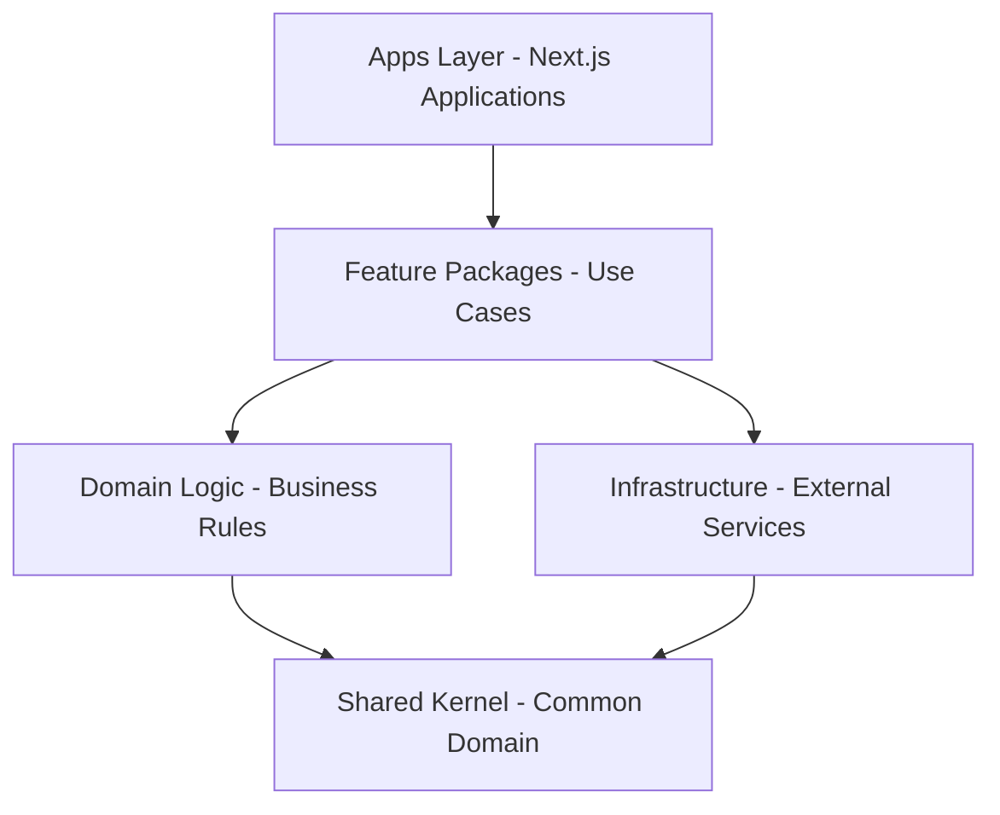

# 🏗️ Architecture Overview

This document explains the Consumer Portals architecture, package relationships, and design principles.

## System Overview

The Consumer Portals platform is built as a monorepo using Turborepo, containing multiple Next.js applications and shared packages. The architecture follows Domain-Driven Design (DDD) and Clean Architecture principles.

## Core Principles

1. **Modularity**: Core functionality is separated into reusable packages
2. **Consistency**: Shared configurations ensure consistent development practices  
3. **Performance**: Optimized build processes and caching via Turborepo
4. **Maintainability**: Clear boundaries between packages with well-defined interfaces
5. **Domain-Driven Design**: Feature packages align with business domains

## Package Architecture



### Layer Definitions

- **Apps Layer**: Next.js applications, UI components, user-facing code
- **Feature Packages**: Application services, use cases, orchestration logic
- **Domain Logic**: Pure business rules, entities, value objects, domain services
- **Infrastructure**: Database access, API clients, third-party integrations
- **Shared Kernel**: Common domain concepts, types, and utilities

## Package Dependencies

```
┌─────────────────┐     ┌─────────────────┐
│  broker-portal  │     │ employer-portal │
└───────┬─────────┘     └────────┬────────┘
        │                        │
        v                        v
┌──────────────────────────────────────────┐
│                @portals/ui               │
├──────────────────────────────────────────┤
│               @portals/auth              │
├──────────────────────────────────────────┤
│            @portals/api-client           │
├──────────────────────────────────────────┤
│              @portals/utils              │ 
├──────────────────────────────────────────┤
│              @portals/types              │
└──────────────────────────────────────────┘
                    │
                    v
┌──────────────────────────────────────────┐
│              @portals/logger             │
└──────────────────────────────────────────┘

┌──────────────────────────────────────────┐
│         Shared Configurations           │
│  @portals/tsconfig, @portals/eslint-config │
└──────────────────────────────────────────┘
```

## Package Responsibilities

### Applications (`apps/`)

| Package | Purpose | Port | Technology |
|---------|---------|------|------------|
| `broker-portal` | Broker tools and management interface | 3000 | Next.js 15, TypeScript |
| `employer-portal` | Employer administration interface | 3001 | Next.js 15, TypeScript |

### Shared Packages (`packages/`)

| Package | Purpose | Exports |
|---------|---------|---------|
| `@portals/ui` | React component library | Components, hooks, utilities |
| `@portals/auth` | Authentication logic | NextAuth.js configuration, hooks |
| `@portals/api-client` | API integration layer | HTTP clients, data fetching hooks |
| `@portals/logger` | Structured logging | Logger instances, log utilities |
| `@portals/testing` | Test utilities and configurations | Test helpers, mock factories |
| `@portals/types` | Shared TypeScript types | Type definitions, interfaces |
| `@portals/utils` | Common utilities | Helper functions, constants |
| `@portals/eslint-config` | ESLint configuration | Linting rules and presets |
| `@portals/tsconfig` | TypeScript configuration | Base TypeScript configs |

## Key Interactions

### Portal Applications → UI Components

```tsx
import { Button, Input, FormLayout } from '@portals/ui';

function LoginForm() {
  return (
    <FormLayout variant="column">
      <Input name="email" label="Email" />
      <Input name="password" label="Password" type="password" />
      <Button variant="primary">Log In</Button>
    </FormLayout>
  );
}
```

### Portal Applications → Authentication

```tsx
import { useSession, signIn, signOut } from '@portals/auth';

function ProfileButton() {
  const { data: session, status } = useSession();
  
  if (status === 'authenticated') {
    return <button onClick={() => signOut()}>Sign Out</button>;
  }
  
  return <button onClick={() => signIn()}>Sign In</button>;
}
```

### Portal Applications → API Client

```tsx
import { useQuery, useMutation } from '@portals/api-client';

function UserProfile() {
  const { data, isLoading, error } = useQuery('/api/user/profile');
  const { mutate } = useMutation('/api/user/profile');
  
  const updateProfile = (data) => {
    mutate(data);
  };
  
  // Component implementation
}
```

### Cross-Package → Logger

```tsx
import { createLogger } from '@portals/logger';

const logger = createLogger({ name: 'user-service' });

export async function processUserData(userId) {
  logger.info('Processing user data', { userId });
  
  try {
    // Process data
    logger.info('User data processed successfully', { userId });
  } catch (error) {
    logger.error('Failed to process user data', { userId, error });
    throw error;
  }
}
```

## Dependency Rules

1. **Dependencies only flow downward** - Higher layers can depend on lower layers, never the reverse
2. **Circular dependencies are forbidden** - No package can depend on itself transitively
3. **Apps can depend on any package** - Applications are at the top of the dependency graph
4. **Packages cannot depend on apps** - Shared packages must remain application-agnostic

## Configuration Sharing

### TypeScript Configuration (`@portals/tsconfig`)

- Provides base TypeScript settings for different project types
- Ensures type consistency across the monorepo
- Configures paths and compilation settings appropriately

Base configurations:
- `base.json` - Common TypeScript settings
- `nextjs.json` - Next.js specific settings
- `react-library.json` - React library settings

### ESLint Configuration (`@portals/eslint-config`)

- Enforces consistent code style
- Configures rules for different frameworks (React, Next.js)
- Ensures code quality across the codebase

## Build & Development Architecture

### Turborepo Orchestration

```json
{
  "pipeline": {
    "build": {
      "dependsOn": ["^build"],
      "outputs": ["dist/**", ".next/**"]
    },
    "dev": {
      "cache": false,
      "persistent": true
    },
    "test": {
      "dependsOn": ["build"],
      "outputs": ["coverage/**"]
    }
  }
}
```

### Key Features

- **Incremental Builds**: Only rebuild packages that have changed
- **Remote Caching**: Share build artifacts across team and CI
- **Parallel Execution**: Run tasks across packages simultaneously
- **Dependency Awareness**: Respects package dependency order

## Technology Stack

| Layer | Technology | Purpose |
|-------|------------|---------|
| **Frontend** | Next.js 15, React 19 | Server-side rendering, routing |
| **Language** | TypeScript (strict) | Type safety, developer experience |
| **Styling** | Tailwind CSS | Utility-first CSS framework |
| **Authentication** | NextAuth.js v5 | OAuth, JWT, session management |
| **Build System** | Turborepo | Monorepo orchestration, caching |
| **Package Manager** | pnpm | Fast, efficient dependency management |
| **Testing** | Jest, Testing Library, Playwright | Unit, integration, e2e testing |
| **Code Quality** | ESLint, Prettier | Linting, formatting |

## Security Architecture

### Authentication Flow

1. User accesses portal application
2. Middleware checks for valid session
3. If unauthenticated, redirect to login page
4. NextAuth.js handles OAuth/credential authentication
5. JWT tokens stored in secure HTTP-only cookies
6. Session validated on each protected route access

### Authorization Patterns

- **Route-level protection**: Middleware guards protected routes
- **Component-level protection**: `useSession` hook for conditional rendering
- **API-level protection**: Server actions validate session before execution

## Performance Considerations

### Bundle Optimization

- **Code Splitting**: Automatic route-based splitting in Next.js
- **Tree Shaking**: Dead code elimination during build
- **Package Optimization**: Shared packages compiled for optimal consumption

### Caching Strategy

- **Build Caching**: Turborepo caches build outputs
- **Runtime Caching**: Next.js caches pages and API responses
- **CDN Caching**: Static assets served via CDN

## Extending the Architecture

### Adding New Packages

1. Create package directory in `packages/`
2. Define `package.json` with appropriate dependencies
3. Export public API through `index.ts`
4. Add package to dependent applications' `transpilePackages`
5. Update documentation

### Adding New Applications

1. Create application directory in `apps/`
2. Configure Next.js with required packages in `transpilePackages`
3. Set up authentication middleware
4. Configure build and dev scripts in `package.json`

### Best Practices

1. **Single Responsibility**: Each package should have one clear purpose
2. **Clear Interfaces**: Export only what consumers need
3. **No Side Effects**: Packages should not perform global side effects
4. **Proper Testing**: All packages should have comprehensive tests
5. **Documentation**: Maintain clear API documentation

## Deployment Architecture

- **Independent Deployment**: Each portal can be deployed separately
- **Shared Dependencies**: Packages are bundled with applications
- **Environment Configuration**: Per-application environment management
- **Container Strategy**: Docker containers for consistent deployments

---

**See Also:**
- [Development Guide](./development.md) for coding standards
- [Testing Guide](./testing.md) for testing strategies
- [Dependency Management](./dependency-management.md) for package management 